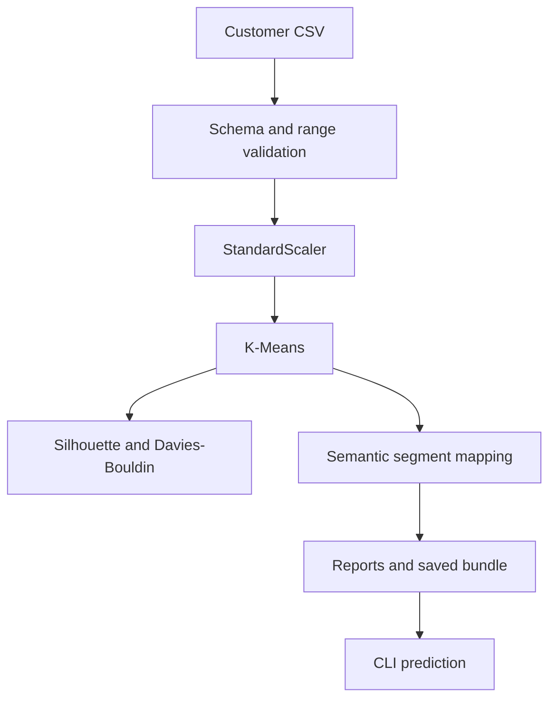

# Customer Segmentation Platform

[](https://github.com/aminbakhtiari777/Customer-Segmentation/actions/workflows/ci.yml)
[](https://www.python.org/)
[](https://scikit-learn.org/)
[](LICENSE)

A reproducible unsupervised-learning project that turns mall customer behavior into five interpretable marketing segments. It includes strict data validation, a scikit-learn training pipeline, intrinsic cluster-quality metrics, stable business labels, artifact persistence, CLI inference, tests, CI, and responsible-use documentation.

## Verified results

The included 200-customer dataset was trained locally with standardized annual income and spending score, `K=5`, `n_init=20`, and random seed 42.

| Metric | Result | Direction |
| --- | ---: | --- |
| Silhouette score | **0.5547** | Higher is better |
| Davies-Bouldin score | **0.5722** | Lower is better |
| Inertia | 65.5684 | Compare only across equivalent feature spaces |
| Customers assigned | 200 / 200 | Complete coverage |

These are intrinsic clustering metrics, not evidence of campaign lift. Business value must be validated with controlled experiments.

## Segment profile

| Segment | Customers | Share | Avg. income (k$) | Avg. spending score | Suggested treatment |
| --- | ---: | ---: | ---: | ---: | --- |
| High-value | 39 | 19.5% | 86.54 | 82.13 | VIP retention and exclusivity |
| Growth-opportunity | 35 | 17.5% | 88.20 | 17.11 | Re-engagement and relevance testing |
| Mainstream | 81 | 40.5% | 55.30 | 49.52 | Broad lifecycle campaigns |
| High-engagement | 22 | 11.0% | 25.73 | 79.36 | Loyalty and value-focused rewards |
| Budget-conscious | 23 | 11.5% | 26.30 | 20.91 | Price-sensitive offers, no pressure |

Segment names are generated from scaled centroid geometry rather than raw K-Means IDs, which can change between model fits.

## Architecture



## Repository layout

```text
data/Mall_Customers.csv            source dataset
notebooks/customer_segmentation.ipynb  original exploratory analysis
src/customer_segmentation/         validation, training, inference, persistence
scripts/train.py                    reproducible training and report generation
scripts/predict.py                  single-customer inference
reports/metrics.json                verified metric snapshot
reports/segment_summary.csv         aggregate segment profile
tests/                              validation, training, prediction, artifact tests
docs/MODEL_CARD.md                  scope, risk, and monitoring guidance
```

## Quick start

```bash
python -m venv .venv
source .venv/bin/activate
pip install -r requirements-dev.txt
python -m pytest
```

Train and create reports:

```bash
python scripts/train.py
```

Predict a saved customer profile:

```bash
python scripts/predict.py --income 88 --spending 17
```

Example output:

```json
{
  "segment": "growth-opportunity",
  "cluster_id": 3,
  "annual_income_k": 88.0,
  "spending_score": 17.0
}
```

## Engineering decisions

- Customer IDs are excluded from model features.
- Gender and age are not used for cluster assignment; age appears only in aggregate reports.
- Input schema, missing values, duplicates, and business ranges are validated before training.
- Training and inference share the same scaler through a single persisted pipeline.
- Human-readable names are separated from unstable numerical cluster IDs.
- The model card explicitly prevents high-impact or individual profiling uses.

See [the model card](docs/MODEL_CARD.md) for limitations and deployment requirements.
